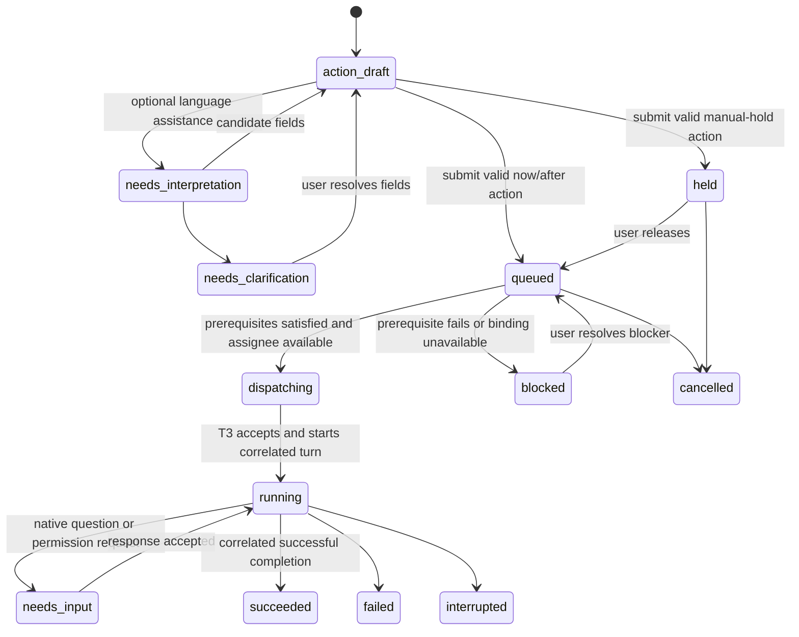

# T3 Rooms — Product Requirements Document

Status: In implementation; single-scope build with two gates (section 10)  
Updated: 2026-09-23  
Working directory: `t3code-rooms`  
Implementation notes: [research/IMPLEMENTATION_ASSESSMENT.md](research/IMPLEMENTATION_ASSESSMENT.md), [README.md](README.md)

## 1. Product definition

T3 Rooms is a local companion interface for collaborating with several persistent coding-agent sessions in one shared conversation. A user opens a project room, adds named participants such as `sol1`, `sol2`, and `claude`, and addresses them by mention or spoken alias. Each participant runs through an existing T3 Code thread. The room delivers shared context, records requested dependencies, and starts queued work when those dependencies are satisfied.

The user should be able to say:

> Sol one, investigate the parser. Sol two, independently inspect the fixtures.
>
> Claude, compare their findings when both finish.

The room makes the resulting assignments and waiting conditions visible. The user does not copy outputs between harnesses or monitor a session solely to send the next instruction. Every supported operation is an explicit application action available through the interface. The first release uses direct controls and explicit command syntax. An optional interpreter can later fill in those actions from natural language; it may use a local classifier such as SemIf or hosted Jev. No interpreter is required for the room or its queue to work.

The companion owns conversation and coordination. T3 owns harness execution. Agent sessions own their workspace strategy, including creating and using zero, one, or multiple worktrees.

## 2. Problem and intended outcome

T3 provides a common interface to different harnesses, but separate sessions remain separate conversations. Work that crosses sessions currently requires a person to carry findings, restate context, and remember when to start dependent tasks.

The desired outcome is a project conversation with persistent participants. Independent work runs concurrently. Sequential work is recorded once and dispatched later with the prerequisite's completed output included. The system remains user-directed; it does not invent a plan, recruit agents, or start an open-ended discussion on its own.

### Success from the user's perspective

- Address two sessions using the same model as `sol1` and `sol2`.
- Read their attributed replies together in a single timeline.
- Ask one participant to act on another's results without pasting those results.
- Queue a review while implementation is running and see what it is waiting for.
- Close the UI and return without losing queued instructions or duplicating dispatches.
- Use existing harness accounts and session histories through T3.
- Let each agent choose its own files, branches, and worktrees.
- Perform every room action directly, with Jev disabled or unavailable.
- Inspect and edit the action suggested from a sentence before submitting it through the normal composer.

## 3. Decisions already made

| Decision | Requirement |
| --- | --- |
| Packaging | Separate local web interface plus a small background service. Initial delivery does not modify T3. |
| Runtime selection | Keep T3 as the execution backend. The user's Herdr trial was unsatisfactory and failed to discover the agent harnesses; Herdr is not part of the implementation path. |
| Project | Reuse a T3 project and its environment-local repository/workspace identity. |
| Room | A durable shared conversation associated with a project. Start with one room per project; permit additional rooms for distinct work. |
| Participant | A stable alias within a room, optional persona, and binding to a persistent T3 thread. |
| Duplicate models | Multiple participants may use the same provider instance, model, and persona. |
| Context | Append unseen shared messages to an existing session. Retain original room history. |
| Workspace ownership | Sessions decide when and how to create worktrees. The room does not create, enforce, merge, or clean them up. |
| Action contract | Define actions, parameter types, preconditions, and visible outcomes first. All input adapters use the same command handlers. |
| Interpretation | Direct controls are the default. Optional local or hosted assistance can map language to the catalog later. |
| Execution | Ordinary code validates, persists, queues, dispatches, and observes work. |
| Voice | Accept OS/third-party dictation as text first. Dictate task content while choosing recipients/timing directly; free-form action interpretation is optional. |
| Orchestration | Only user-requested assignments and dependencies. No supervising generative model is required. |

An alias is not a model ID or an account. Renaming `sol1` does not change its model. Two sessions using an account share its applicable capacity; naming them separately does not create additional quota. No cache isolation or lifetime guarantee is part of this product.

## 4. Interface and primary workflow

### 4.1 Room layout

1. **Sidebar:** projects and rooms, with waiting/working indicators.
2. **Participant bar:** alias, provider/model, optional role, and status; add or attach a participant.
3. **Timeline:** user messages, attributed assistant replies, and compact task-status cards. Stream in-progress replies in their own cards without mixing text from different speakers.
4. **Composer:** text entry, mention completion, recipient chips, and a timing control.
5. **Queue drawer:** pending assignments, prerequisites, blockers, and edit/cancel/release controls.

Every participant provides an “Open in T3” action for its native session. Where a supported deep link is unavailable, show its T3 project and thread identity for navigation. Full native tool inspection remains accessible in T3; the companion must not imply that an abbreviated tool view is complete.

### 4.2 Add a participant

The user chooses an alias and a provider/model from the connected T3 server's actual catalog, optionally adds a persona brief, and creates or attaches an existing thread. Alias uniqueness is enforced per room with case-insensitive matching. Spoken equivalents such as “sol two” can map to `sol2`.

The normal lifecycle is one persistent thread per participant. A participant can be explicitly rebound to a replacement thread, with the old binding retained in history and a bootstrap briefing delivered to the replacement. Rebinding must account for outstanding tasks; it cannot silently send a pending task to a different session.

Personas are modelled as **roles**: named rule sets kept in a library and assigned to a participant within a room. An alias is room-local and names exactly one T3 thread; it has no existence outside its room. The thread's model, options, and permission mode are owned by T3: the room mirrors them from the thread on every poll and changes them only through T3 (`thread.meta.update`, `thread.runtime-mode.set`), never holding a competing copy. The provider of a thread cannot change. Role rules are delivered as plain text with every assignment because T3 has no per-thread instruction field; the harness's repository instruction files remain its own mechanism. A rule saying “read-only” is not an enforced permission mode: the UI shows the actual permission mode supported by T3 separately from the role.

### 4.3 Send and schedule

| Input | Expected behavior |
| --- | --- |
| `@sol2 review the current diff` | Assign to sol2 now; wait in sol2's ordinary queue if busy. |
| `@sol1 @sol2 independently investigate the timeout` | Create two independent assignments with the same source request. |
| `@sol2 review the parser when sol1 finishes` | Create a sol2 assignment dependent on the identified sol1 task. |
| `Sol two, review once sol one finishes the parser` | Resolve spoken aliases and the same dependency. |
| `@claude compare their changes after both finish` | Bind to both identified tasks, if the room context resolves “both.” |
| `@sol2 save this for later; wait until I release it` | Create a manually held task with no automatic release trigger. |
| `For context, preserve the public API. No action needed.` | Append a room note; do not invoke a participant. |
| `@sol2 review once it is done` with multiple possible antecedents | Show a prerequisite picker; do not guess from confidence alone. |

The composer and resulting timeline card show the action in ordinary language: **To sol2 · After sol1: implement parser**. In the initial release, the user fills these fields directly or through explicit syntax. If an interpreter is later enabled, it prepares the same editable draft before submission. The normal **Send**, **Queue**, or **Save for later** button commits the visible action. There is no separate confirmation modal. An unresolved interpretation stays in the composer with the missing field highlighted. A model response arriving later cannot execute an action that was never submitted.

For the same queued review, the user can bypass language interpretation completely: select **sol2**, choose **After tasks**, pick **sol1: implement parser**, type **Review the implementation**, and press **Queue**. This creates the same command and delivery behavior as an accepted Jev suggestion.

A contextual shortcut removes most of those steps: **Add follow-up** on sol1's task card preselects that exact task/revision as the prerequisite. Choose sol2, type or dictate the review instruction, and press Queue. Selecting two task cards can prefill an **After both** assignment. Neither interaction needs semantic classification.

Users can edit or cancel work that has not been dispatched. An instruction already accepted by T3 requires an explicit interrupt/follow-up operation; changing the local card cannot retract a delivered prompt.

### 4.4 Action catalog

These are the initial room actions. Define their handlers and direct UI controls before adding their natural-language mappings. Display only actions applicable to the selected object; the service still validates them at submission time.

| User action | Command | Required fields | Direct UI | Preconditions and result |
| --- | --- | --- | --- | --- |
| Send now | `task.create`, timing `now` | Recipients, instruction | Recipient chips + Send | Create independent tasks for selected participants; busy participants wait in their ordinary queues. |
| Run after tasks | `task.create`, timing `after_all` | Recipients, instruction, prerequisite task revisions | Timing picker + prerequisite picker + Queue; also “Add follow-up” on a task card | Resolve all prerequisites; reject cycles; release only after all succeed. |
| Save for later | `task.create`, timing `manual` | Recipients, instruction | Timing picker + Save for later | Create held tasks; completion of other work does not release them. |
| Post a room note | `room.note.create` | Original text | Note mode + Post | Append shared context without invoking a participant. |
| Edit pending work | `task.update` | Task ID/revision, changed instruction/recipients/timing fields | Edit on pending task | Allowed before dispatch; validate the complete replacement and create a new revision. |
| Release held work | `task.release` | Task ID/revision | Release on held task | Move a manually held task to the ordinary ready queue; busy-session ordering still applies. |
| Cancel pending work | `task.cancel` | Task ID/revision | Cancel on pending task | Cancel work not accepted by T3; expose the resulting block on dependent tasks. |
| Interrupt a run | `task.interrupt` | Task/run ID | Stop on running task | Request interruption through T3 and observe the actual outcome; do not pretend a completed run was interrupted. |
| Retry failed/interrupted work | `task.retry` | Task ID/revision and explicit dependent-task handling | Retry on task card | Record a new attempt; show whether dependents will follow that attempt. |

Participant creation/attachment, renaming, binding changes, removal (`participant.retire`, which keeps past attribution, releases the alias, and requires an explicit choice to cancel or keep the participant's pending tasks), room creation, and responses to native harness questions/permissions also have direct forms or contextual controls. Deleting a participant's thread in T3 Code is detected as a missing thread: the room blocks new work for that participant with a visible reason until it is rebound or removed; settling or archiving in T3 has no effect on the room. They do not depend on Jev and are outside its initial selectable action subset. Rebinding remains subject to the outstanding-task rule in section 4.2. Answering a native permission request uses the options reported by T3; Jev does not invent or automatically approve them.

The operation **review** is an instruction to a participant, not a separate application action. **Review now**, **review after task 41**, and **save a review for later** use the same task-creation handler with different timing. This avoids building a new command for every type of coding work.

### 4.5 Shared command contract

Both direct controls and accepted Jev suggestions construct the same versioned command. For example:

```json
{
  "type": "task.create",
  "roomId": "room_payments",
  "recipients": ["participant_sol2"],
  "instruction": "Review the implementation",
  "schedule": {
    "mode": "after_all",
    "prerequisites": [{"taskId": "task41", "revision": 1}]
  }
}
```

The service supplies/checks trusted command identity, current room revision, participant binding generations, and submission provenance. Aliases shown in the UI resolve to stable participant IDs. The command schema is a discriminated union: `now` and `manual` do not accept prerequisite fields; `after_all` requires a nonempty list. Unknown action names, invalid enum values, nonexistent references, unsupported fields, and stale revisions fail validation before execution.

Keep `instruction` as user-authored text or a selected verbatim source span. Jev selects existing action/participant/task options; it does not generate arbitrary identifiers or instructions. Preserve the original sentence alongside the prepared command for inspection.

Manual edits take precedence over model suggestions. Track draft revision and the provenance of each field. Editing the source text invalidates outstanding inference; a late answer cannot overwrite newer selections. Users can switch off Jev entirely, and all composer, task-card, participant, and queue controls still work.

## 5. Optional interpretation adapters

### 5.0 Direct operation first; replaceable assistance later

Implement one action-draft boundary. Direct controls, explicit command syntax, and optional inference all produce candidate values for the same catalog. Keep the scheduler independent of how those values were obtained.

| Input mode | Responsibility | Model requirement | Release position |
| --- | --- | --- | --- |
| Direct controls | Select recipients, timing, task references, and instruction | None | Default first release |
| Explicit syntax | Parse a documented grammar into those same fields | None | First-release convenience |
| Local SemIf | Score offered actions and candidate references locally | Downloaded model and supported runtime | Optional later experiment |
| Hosted Jev | Answer typed action/reference questions over its API | Jev credential and network access | Optional adapter with existing research evidence |

Example proposed syntax: `@sol2 review the diff` for a visible **Now** draft, and `/after task41 @sol2 review the implementation` for a visible **After task41** draft. Only the defined addressing/command syntax is interpreted; task text remains verbatim. Resolve IDs and aliases with exact matching, and retain invalid or incomplete commands as drafts. This parser is not expected to understand arbitrary paraphrases of “after.” The GUI remains the way to express every action without memorizing syntax.

The optional interpreter boundary should return an action candidate, candidate parameter IDs, unresolved fields, source spans where available, and provider-specific evidence. Preserve which adapter produced each field. Do not force a local model's scores into Jev's confidence representation or reuse thresholds across adapters without evaluation.

The supplied video is titled **How to Build Things with Jev & OpenJevs**. Its creator's description identifies a model-router demo using hosted Jev and SemIf, with architecture at 11:47 and SemIf at 15:06. The full transcript was not retrievable during this review; no detailed claims about the spoken walkthrough are assumed. [Video](https://www.youtube.com/watch?v=ZR7anrL50xs).

SemIf is an independent open implementation of semantic option scoring, formerly named OpenJev. Its repository exposes native scoring, an MLX path for Apple Silicon, and a browser demonstration. It does not contain TypeSafe's model or training. Its scoring API would need a room adapter; it is not assumed to be a drop-in replacement for the Jev HTTP endpoint. [SemIf source](https://github.com/TheoLeeCJ/SemIf).

The browser demonstration requires model downloads, and its documented native/backend scores are conditional on the offered options. A high local score does not establish intent correctness. Test the room's own action/reference dataset with a pinned model/runtime before enabling local suggestions. Native service placement is an implementation option if background inference is needed; the durable queue must continue without either model or an open browser. [MLX backend](https://github.com/TheoLeeCJ/SemIf/blob/master/src/semif_phase1/mlx_backend.py), [browser implementation](https://github.com/TheoLeeCJ/SemIf/blob/master/webgpu-demo/README.md).

The transfer from a model-router demonstration is the separation of decision selection from execution. In this product, the decisions are room actions, participants, and prerequisite tasks. Do not automatically switch a persistent participant's harness/model just because a separate demonstration routes prompts between models.

Sections 5.1–5.5 retain the Jev-specific integration design and research boundaries. They do not make hosted Jev a prerequisite for Phase 1. No SemIf installation, local inference benchmark, or automatic-parser implementation has been performed in this review.

### 5.1 What Jev contributes

TypeSafe's API takes application state and a map of typed questions. Choice returns one supplied option and its distribution/confidence; Noul returns a probability for a yes/no proposition. Questions in a call are evaluated independently against the same state. This fits selecting an offered action and resolving its remaining bounded parameters. [Introduction](https://docs.typesafe.ai/introduction), [primitives](https://docs.typesafe.ai/primitives), [fan-out pattern](https://docs.typesafe.ai/patterns/fan-out).

The implementation order is: action catalog and handlers → complete direct controls → deterministic command validation/scheduling → optional interpretation adapters. Jev does not define product capabilities or receive a separate execution path. It returns candidate field values that become an editable action draft.

Jev does not generate the task instructions or a free-form workflow. Preserve the user's text verbatim. Enumerate participants and candidate task IDs in code. For a message assigning different work to different people, the outgoing briefing identifies the recipient and includes the original message, with an instruction to perform only the part addressed to that recipient. Do not invent rewritten requirements.

### 5.2 Request shape and model version

Use `POST https://api.typesafe.ai/v1/systemone` with bearer authentication. The local service reads `JEV_API_KEY` from `.env` or its process environment and supplies it as the bearer token. TypeSafe examples use a different environment-variable name; the HTTP protocol does not require renaming the user's variable. Keep this credential in the service, never in a browser bundle, room message, or provider prompt.

Initial evaluation is pinned to `jev-1.13.0`, the version documented and exercised on 2026-09-21. Record the actual response model, question-template version, and interpretation revision. Re-evaluate before changing the pinned version. The request/response protocol is described in the [API reference](https://docs.typesafe.ai/api); version aliases and limits are documented under [models](https://docs.typesafe.ai/models).

Example of a real question shape used by the probe:

```json
{
  "model": "jev-1.13.0",
  "state": {
    "latest_user_message": "@sol2 review the parser when sol1 finishes",
    "participants": [{"alias": "sol1"}, {"alias": "sol2"}],
    "tasks": [{"id": "task41", "assignee": "sol1", "title": "Implement the webhook parser", "status": "running"}]
  },
  "questions": {
    "sol2_after_task41": {
      "type": "noul",
      "instructions": "Does the user require sol2's review to start after task41, sol1's parser implementation, finishes?"
    }
  }
}
```

Question-map keys are application identifiers; the API says they are not used in inference. The instructions must themselves identify the participant/task being evaluated. The example is one edge question, not a complete router request.

### 5.3 Design actions that Jev can select

An action is suitable for Jev assistance when its name is from a finite enum, its routing parameters are known choices or candidate IDs, its text comes from the user's input, and code can check its preconditions. Each selectable action also needs an uncertainty/unsupported outcome and examples of both matching and nonmatching language. Do not force a request into the closest available action.

The initial Jev action choices are `send_now`, `send_after`, `save_for_later`, `post_note`, and supported pending-task controls such as `cancel_pending` and `release_held`, plus `clarify` and `unsupported`. These choices map to the canonical commands in section 4.4. For example, `send_after` maps to `task.create` with schedule mode `after_all`. Changing a task's arbitrary text, adding a new participant, interrupting, or retrying can initially remain direct-UI operations until their mappings have separate evidence.

Use two stages when action selection determines the needed parameters:

| Stage | Question | Result and application behavior |
| --- | --- | --- |
| A: action | Which offered action matches the request? | One Choice among applicable action types, `clarify`, and `unsupported`. Skip if the user selected the action directly. |
| B: recipients | Who receives this task? | Resolve only missing recipients from the room roster. Explicit chips are already resolved and are not reclassified. |
| B: prerequisites | Which candidate tasks must finish? | Asked for `send_after` only; select known task revisions and validate references. |
| B: existing target | Which pending task is being controlled? | Asked for a relevant control action only; choose an applicable task ID or unresolved outcome. |

Stage B questions may run in parallel when independent. A note requires no recipient question. A manually held task requires no prerequisite question. Uncertain answers to irrelevant questions must not block a valid action. “Save new work for later” and “release an existing held task” are separate action choices with explicit criteria.

Include the latest user message, roster, small candidate task list, explicit UI selections, and only recent context needed to resolve references. Do not send the whole project transcript or tool history merely to decide routing. Jev's reference state is separate from the larger briefing delivered to a coding agent. [State guidance](https://docs.typesafe.ai/concepts/state).

Questions cannot consume sibling answers from the same call. Stage B follows Stage A when it needs the selected action; this may require two calls. A single speculative call is an optimization only if irrelevant answers are ignored correctly. The earlier probe used approximately `1 + participants × (2 + candidate tasks)` questions for every message; it is evidence about that prototype, not the required production question layout. Limit the candidate set before dispatch; if ambiguity requires more candidates, ask the user or expand deliberately.

### 5.4 Interpretation and validation

The earlier prototype uses Choice confidence ≥ 0.80, dependency Noul ≥ 0.85 for yes, and ≤ 0.15 for no. Values in between request clarification. These are exploratory policy settings, not calibrated production guarantees, and are not automatically inherited by the new action mappings. Choice confidence is derived from its option distribution; Noul has no separate confidence field. Neither is an independent proof that the intended task was selected. [Confidence](https://docs.typesafe.ai/confidence).

Distinguish three acceptance claims:

1. **Action coverage:** every supported action is available manually with Jev disabled. Target 100% coverage of the catalog.
2. **Command validity:** every accepted command passes schema, reference, permission, and state-transition checks. An invalid command never reaches the scheduler. This is a code contract to test.
3. **Intent accuracy:** Jev selected what the user meant. A bounded option set cannot guarantee this; a valid selection may still be wrong. Evaluate accuracy separately, retain editable drafts, and provide unresolved/unsupported outcomes.

Therefore “100% Jev accuracy” is not a product promise. The product must work correctly from direct selections even when no natural-language interpretation is available.

Before accepting an interpretation, code must check:

- Participants and task references belong to this room and still exist.
- Explicit UI selections are authoritative; inferred choices cannot override them.
- A task mentioned as a prerequisite is not automatically a recipient.
- Every dependency is grounded by an explicit task/author/topic reference or an unambiguous room selection. A pronoun plus several plausible tasks is insufficient.
- A `send_after` draft has a nonempty, resolved prerequisite set and maps to schedule mode `after_all`. “Now” plus selected prerequisite edges is an inconsistency to resolve.
- The resulting graph has no self-edge or cycle. For fan-in, all requested predecessors are represented; unresolved candidates cannot be silently dropped.
- The roster/task revision used for interpretation is still valid when the task is saved. Store the snapshot and re-resolve if relevant state changed.
- Only a submitted user message can create assignments. Assistant outputs, quoted examples, and tool logs are context, not automatic dispatch triggers.

On a Jev error or timeout, preserve the draft and keep all direct action controls usable. Do not silently turn a conditional request into an immediate send. Jev cannot directly invoke a command handler; the normal user submission commits the prepared action through the same validator as manual input. Once accepted, a queued task runs without further Jev calls or continued Jev availability.

TypeSafe documents literal-reading, indirection, distracting context, and structural-consistency limitations. Those are reasons to test exact questions and validate the combined answer in code. [Model limitations](https://docs.typesafe.ai/model-jaggedness/jev-1.13).

### 5.5 Compound messages and scope boundary

The first release supports a request addressed to one or multiple participants, with optional dependencies on already identified tasks. It must correctly record the user's central flow: while sol1 is working, queue sol2's review of that task.

A single message such as `@sol1 implement X, then @sol2 review it` needs prospective nodes for assignments created within that same message. **Implemented (2026-09-24) with a deterministic clause parser, no model:** the message is split at addressing @mentions (leading mentions share one assignment; later ones start a new assignment unless they read as references), an assignment waits for an earlier one when it follows "then" or names one of its recipients, and `/now` opts out. The composer shows the resulting plan before sending (one row per assignment, with the timing and its reason) and offers one-click corrections that rewrite the text, so the text stays the single source of truth. The service creates all tasks of a message atomically (`message.create`), resolving in-message waits to the tasks it creates, pinned at revision 1. An interpreter (Jev or SemIf), if added later, would propose the same assignment list and edges for the user to confirm; it still cannot invent IDs or instruction strings.

## 6. Durable queue and task lifecycle

### 6.1 Minimal records

| Record | Essential fields |
| --- | --- |
| Room | ID, T3 environment/project IDs, title, next event sequence |
| Participant | Stable ID/alias, spoken aliases, optional brief, provider/model selection, current binding generation |
| Session binding | Participant ID, generation, T3 thread ID, created/retired timestamps |
| Room event | ID, sequence, source/speaker, content, task/run attribution, artifact references, timestamp |
| Task | ID, revision, source user-message ID, assignee/binding, original instruction, timing, dependency references, state |
| Run | Task revision, T3 command/message/turn identities, execution status, completion evidence |
| Interpretation | User-message ID, state revision, model/template version, typed answers, chosen plan, user edits |
| Action draft | Draft revision, action type, parameter values and their manual/inferred provenance, unresolved fields, source text |
| Delivery | Task/run ID, exact briefing, included event IDs/sequence range, command ID, acceptance state |

Use a local SQLite database for transactional task persistence and an outbox. A JSON log is sufficient for a disposable conversation demo, but the product promise of restart-safe dispatch needs durable task, dependency, and delivery records.

### 6.2 States



`action_draft`, `needs_interpretation`, and `needs_clarification` are composer states; a task is created only when the user submits a valid action. `queued` carries a visible reason: waiting for named tasks, waiting for the assignee, or ready for dispatch. Manual hold is distinct from dependency waiting. An interpretation awaiting clarification has not authorized any partial dispatch from that message. Direct UI actions reach the queue without entering a Jev state.

### 6.3 Dependency behavior

- Bind dependencies to specific task revisions, not an alias's next transition to idle.
- A task waits for all predecessors, unless a future feature explicitly introduces other semantics. “After either” is outside initial scope.
- Already successful prerequisites do not introduce a new wait.
- Failure, interruption, or unresolved native input does not release dependents.
- A new attempt after a failed task is an explicit user operation. Record whether dependent tasks are reattached to that attempt; do not silently treat unrelated later work as the prerequisite's completion.
- One room-dispatched turn at a time per participant. Different participants can run concurrently within provider capacity.
- The service owns dependency waiting. Do not send a review to the harness early and rely on the agent to keep checking another session.

### 6.4 Completion contract

For the first release, a task is one bounded assignment delivered as a T3 turn. A dependency completes when the adapter observes that correlated turn's successful terminal state, no outstanding blocking request, and the final response/artifact metadata needed for the handoff has been ingested. Dispatch acknowledgement, a commentary message, or an idle thread observed without run correlation is insufficient.

This is an execution milestone, not proof that the implementation is correct or that an arbitrary multi-turn project goal is achieved. A provider may return a normal final response containing a prose blocker without an equivalent native blocked state. The first release must expose that limitation and let the user mark a task blocked; it must not advertise universal semantic completion detection. A later explicit `report_task_outcome` facility or a separately evaluated result classifier can improve this without changing the scheduling model.

Do not depend on T3's test-only receipt bus in production. Use supported persisted states/events or bounded polling through the adapter. T3 separates command acceptance, provider completion, and follow-up checkpoint work; the adapter must preserve these distinctions. [T3 architecture](https://github.com/pingdotgg/t3code/blob/main/docs/internals/overview.md)

T3 emits no discrete `turn.completed`, `turn.failed`, or `turn.interrupted` event (verified against the contracts and the local event log on 2026-09-23). The observable terminal sequence for a turn is: provider `thread.session-set` with `status: running` and `activeTurnId` set; the assistant `thread.message-sent` with `streaming: false` and the `turnId`; provider `thread.session-set` with `status: ready` or `error` and `activeTurnId: null`; then a server `thread.turn-diff-completed` carrying `turnId`, `status: ready|error`, `assistantMessageId`, and changed files. The projected read model exposes this as `latestTurn.state` (`running`, `completed`, `error`, `interrupted`) and a per-turn checkpoint. T3 does not stamp the user message with its turn id (verified live 2026-09-23); the adapter correlates the room's own user `messageId` by adjacency, using the provider messages that follow it before the next user message, or the session's active turn while nothing has been produced yet. It then reads that exact turn's state or checkpoint. It never infers success from the thread being idle..

Do not use `thread.settled` alone as the completion trigger. T3 emits it for manual settlement and automatic lifecycle policies as well; it does not identify a successful run of our assignment. Correlate the submitted turn and its outcome through the actual thread subscription. Likewise, an alternate Herdr adapter cannot treat an uncorrelated `agent.wait` return as success for a particular task. [T3 settlement implementation](https://github.com/pingdotgg/t3code/blob/main/apps/server/src/orchestration/decider.ts), [Herdr wait semantics](https://herdr.dev/docs/agent-automation/).

### 6.5 Restart and retry behavior

Persist the task and dispatch intent before external submission. Use a stable T3 command ID for an identical retry, and store the exact outgoing briefing; a retry must not rebuild it with newer context while reusing the ID. After reconnect, reconcile accepted commands and correlated turns before issuing another dispatch.

Advance delivery bookkeeping when acceptance is confirmed, not when merely preparing a request. Do not treat an HTTP acknowledgement as task completion. Deduplicate imported room events by source identity. Editing a pending instruction creates a new revision/command identity.

UI closure does not stop the companion service. If the service itself is stopped, queued tasks remain persisted and reconciliation occurs on restart. Jobs do not magically run while the machine/service is offline.

## 7. Shared-context contract

The room retains original user messages and completed participant replies with stable ordering and attribution. Each session retains its own native conversation. The wrapper never rewrites that native history to mimic a shared multi-speaker transcript.

At dispatch:

1. Freeze a room sequence cutoff.
2. Gather shared messages this binding has not received and does not already own through its native output.
3. Include prerequisite results and their reported file, branch, commit, or artifact references.
4. Append the current assignment separately, identifying its recipient and already satisfied dependencies.
5. Save the exact briefing and source event IDs before sending.

Parallel tasks released together use a common initial room cutoff. A later review assembles its briefing only when released, so it includes completed predecessor output. In-progress streaming text is visible in the UI but is not automatically injected into another running session.

Preserve every unseen visible message while it fits the delivery budget. Do not keep only the latest reply per sibling: earlier decisions and corrections may still matter. If history exceeds the budget, show that condensation occurred, retain source references, and provide access to originals. Jev cannot write these summaries. Initial implementation can use user-pinned decisions and an explicit handoff summary from an existing coding session; a generative summarizer is an optional later component, not a required orchestrator.

A new/replacement session gets a bootstrap briefing plus access to retained history. Native compaction stays under harness control. An event-delivery cursor means “delivered,” not “the model still remembers every token”; important task-specific context can be reattached after compaction without replaying the entire room on every turn.

Use a clear attribution envelope for shared outputs. Another participant's suggestions remain that participant's statements, not new instructions from the user. Agent replies never recursively create work merely because they contain a mention.

## 8. Workspace and artifact ownership

The room does not prescribe one worktree per participant. Agents can operate in the existing checkout, create multiple worktrees, stay read-only, and arrange integration themselves.

The outgoing session brief asks agents to identify relevant output locations when handing work off: path, branch, commit/diff, and any unfinished integration. These reports are shared automatically. They are not evidence that two independent worktrees have been merged.

A reviewer follows the producer's reported location; the room must not silently assume that `main` contains the work. T3's bound working directory and native diff/checkpoint behavior remain T3 concerns. Creating a worktree through shell tools does not imply that the companion has rebound the native session.

## 9. T3 integration boundary

Build one adapter exposing project/provider discovery, thread creation/attachment, turn submission, execution observation, conversation reads, pending-request responses, and interruption. Store T3 identities as opaque values. Inspect the connected server's real capabilities/model catalog rather than relying on example model names.

The existing T3 HTTP/RPC contracts support the underlying command and observation approach. They are application interfaces, not a promise of permanent third-party compatibility. Pin tested versions and run adapter contract checks before upgrading. Relevant sources: [HTTP contracts](https://github.com/pingdotgg/t3code/blob/main/packages/contracts/src/environmentHttp.ts), [orchestration contracts](https://github.com/pingdotgg/t3code/blob/main/packages/contracts/src/orchestration.ts).

The third-party [t3code-thread-mcp](https://github.com/samdickson22/t3code-thread-mcp) is a candidate adapter implementation. Its current README reports direct-connection tests against T3 0.0.40 and 0.0.42. It provides create/read/send/wait controls, but caps returned message text at 8,000 characters and does not create worktrees. Its desktop discovery requires a companion T3 change. Use direct authenticated connections for the no-fork path. Do not treat its truncated reads as a complete room archive: evaluate a full-message API or explicit artifact retrieval before claiming lossless context.

Only the companion service needs control-plane access to T3. The first release does not require installing cross-thread messaging tools into every participant. The service should detect activity initiated directly in T3 and avoid colliding with it; direct activity can occupy a session but must not accidentally satisfy an unrelated room prerequisite. Turn-start events carry the command identity and actor kind, so any turn the room did not issue is recognisable as external.

**Credential precondition.** T3 issues third-party credentials only through one-time pairing links exchanged at `POST /oauth/token`. The Desktop app on loopback selects the `desktop-managed-local` auth policy, which advertises only `desktop-bootstrap` and therefore cannot pair a companion. Enabling **Settings → Connections → Network access** switches the server to `remote-reachable` and enables pairing links; a headless `t3 serve` or background service uses `loopback-browser` and pairs with `t3 pair`. The upstream change that would have let local tools reuse the Desktop connection, [PR #12148](https://github.com/pingdotgg/t3code/pull/12148), was closed unmerged on 2026-09-19. The companion stores the exchanged token in its data directory with owner-only permissions.

**Persona and permissions.** No T3 command carries a per-thread persona or system-instruction field. Persona text is delivered in the first turn's briefing (and repository instruction files remain the harness's own mechanism). Permission mode is a real T3 setting (`thread.runtime-mode.set`: approval-required, auto-accept-edits, auto, full-access) and is shown and set separately from the persona.

**Catalog.** The provider/model catalog lives behind the WebSocket RPC (`server.getConfig`). The HTTP adapter uses the local model manifest plus enabled provider instances when the server is local, and models observed on existing threads otherwise; entries are labelled with their source. Speaking the WebSocket RPC is a later adapter improvement.

The previously cited PRs #12457 and #9181 were closed unmerged but concern unrelated features (per-instance Cursor configuration directories and mid-thread account switching). They are not evidence about third-party API access. This PRD does not rely on them or on unverified claims about the user's existing session history.

## 10. Scope and delivery sequence

### Phase 0 — feasibility, delivered with this PRD

- Read TypeSafe's request, primitive, confidence, and model-limit documentation.
- Exercise the supplied Jev key using synthetic routing cases.
- Retain requests, answers, expectations, timing, and failure cases.
- Define product boundaries and acceptance criteria.

This phase does not start T3 sessions, test the scheduler against real harnesses, or build the room interface.

### Single build, two gates

Decision 2026-09-23: the former Phase 1 and most of Phase 2 are delivered as one build. Phasing is retained only as build order (deterministic scheduler against a fake adapter, then real harnesses, then interpretation) and as two release gates.

Core scope (built first):

- The versioned action catalog, preconditions, command handlers, and complete direct controls.
- One connected T3 environment; existing projects and the available provider catalog.
- Create/attach named participants with optional persona briefs and visible permission mode.
- Shared timeline, explicit recipient/timing controls, and preserved room notes.
- Exact alias/explicit-command parsing into the same editable draft, with no model call.
- Dependencies on existing room tasks, including waiting for both tasks.
- Manually held tasks, edit/cancel/release/retry/mark-blocked, pending-input and error visibility.
- Persistent SQLite queue/outbox, reconnect reconciliation, and context delivery.
- Agent-managed workspaces; links back to native T3 sessions.
- Task feedback: activity summaries, files changed, error display, and inspection of the exact delivered briefing.

Included in the same build after the core passes its tests:

- Alias pools such as `@sol` selecting an available participant.
- Explicit task-outcome reporting for prose blockers (user mark-blocked is in the core).
- Additional T3 environments through the same adapter, one credential per environment.
- Richer feedback: full diff drawer, usage meter, screenshots as attachments.

Gate 1 (before any real-harness acceptance run): the companion is paired with a T3 server that offers one-time-token pairing (see section 9), and the live contract check (`npm run t3:check -- --write`) passes for turn correlation, interrupt, and long-message reads. **Passed 2026-09-23** against the Desktop server (`0.0.43-nightly.20260923.2150`, policy `remote-reachable`) with Claude Sonnet 5: every check passed, including identical resend without a duplicate prompt and an observed `interrupted` state.

Gate 2 (before the interpreter toggle defaults on): a hosted Jev or local SemIf mapping meets the quality gate in section 11 on fresh examples. Until then the interpreter boundary exists but ships disabled; the deterministic clause parser and its plan preview cover compound sentences.

Deferred: a generative context summariser (pinned decisions and explicit handoffs cover the core), in-app microphone transcription (OS dictation into the composer already works), and a model-based interpreter for compound sentences (the deterministic clause parser covers the common forms).

Out of scope: a T3 fork, automatic worktree administration, autonomous agent debates, recursive mention-triggered delegation, replacing harness execution loops, automatic account provisioning, calendar scheduling, and a general workflow programming language.

## 11. Acceptance criteria and validation plan

| Area | Required evidence before calling Phase 1 complete |
| --- | --- |
| Manual coverage | Every action in the catalog and all participant/native-request controls work with inference disabled, no Jev key, and no local classifier installed. |
| Action parity | Direct controls and explicit syntax use the same handler and produce equivalent task/queue effects; optional inferred drafts must later pass the same parity tests. |
| Contract validation | Unknown actions, invalid enums, nonexistent references, cycles, stale revisions, and inapplicable transitions are rejected before execution. |
| Draft control | Explicit field choices survive inference; stale responses cannot overwrite a newer draft or trigger execution. |
| Named sessions | Two aliases using the same provider/model retain separate native histories across multiple turns. |
| Parallel work | One user message starts two eligible participants without waiting for the first result. |
| Sequential review | A review sent while implementation is running remains in the room queue, then receives its completed output exactly once. |
| Fan-in | A task waits for both identified prerequisites; completion of only one does not release it. |
| Run correlation | An old completion event or unrelated direct T3 turn cannot release a dependency. |
| Context | Earlier unseen decisions survive multiple sibling replies; long-message truncation is surfaced and originals remain retrievable. |
| Restart | Restart after submission but before acknowledgement causes reconciliation, not duplicate work or lost context. |
| Failures | Failed/interrupted/input-blocked predecessors keep dependents blocked with the reason visible. |
| Editing | Pending tasks can be changed/cancelled; already accepted tasks are not falsely shown as retracted. |
| Input parsing | Exact aliases, explicit commands, incomplete syntax, and missing task references produce the specified editable drafts/errors without a model. |
| Workspace scope | Agents can choose worktree strategy; the room forwards artifact locations without creating worktrees. |
| Secrets | Jev/T3 credentials remain outside browser payloads, room events, logs, and version control. |
| Task feedback | Each task card shows delivery, start, completion or failure with the reason, files changed, and the exact briefing that was sent; partial views are labelled as partial. |
| Persistence rules | (1) Identical resend reuses the T3 command id and frozen briefing; user retry is a new attempt with a new identity and explicit dependent handling. (2) Cancelling a prerequisite blocks dependents with the reason. (3) Editing a task creates a new revision and does not retarget dependents unless the user chooses to carry them. (4) The user can mark a completed task blocked; already delivered dependents are not retracted. (5) Recovery from an unknown acknowledgement resends identically and never mints a new id. (6) Stale checks use the task revision for task operations and the binding generation for delivery. |

Validate deterministic actions first with meaningful state-transition and integration tests, including queue recovery. For later interpretation adapters, evaluate each natural-language mapping separately: exact action and parameter agreement, suggestion coverage, incorrect suggestions, and unnecessary clarification. Include notes, quotes, negation, spoken aliases, delayed work, missing references, repeated runs, and held-out phrasing. A confidence threshold is not a product quality metric by itself. The initial synthetic probe is feasibility evidence for an earlier Jev question layout, not a production reliability benchmark or evidence about SemIf.

Release the deterministic action interface only after all supported catalog actions are reachable without Jev and their required acceptance tests pass. For each enabled Jev mapping, proposed quality gate: on an independently reviewed set totaling at least 100 representative instructions, at least 95% exact suggestions for clear in-scope commands and no observed confidently wrong recipient/prerequisite suggestion in the acceptance run. Report sample size and uncertainty; passing a finite set does not guarantee future correctness. Mappings that miss the gate can remain disabled while their direct UI actions remain available. Ambiguous cases resolve through the composer without a required generative fallback.

Latency target: a single interpretation call should typically add less than one second locally; separately measure the total time for a two-stage mapping rather than assuming the earlier one-call timing still applies. Direct controls must not wait for Jev. Performance targets are provisional until measured with realistic room sizes and the deployed connection.

## 12. Evidence and open implementation questions

See [live Jev findings](research/JEV_FINDINGS.md), the [reproducible probe](scripts/probe_jev.py), and the [development fixtures](research/jev-routing-cases.json). Findings distinguish model answers from code-enforced validation, report wording revisions, and retain failed cases.

The user tried Herdr and reported disliking the experience and that it could not find the agent harnesses. T3 remains the selected execution backend; a further Herdr pilot is not a prerequisite. The cause of the detection failure was not diagnosed, and Synapse functionality was not established by that trial. The [Herdr and Synapse assessment](research/HERDR_ASSESSMENT.md) retains the source research and records this user-reported outcome.

The earlier question/policy version matched 14/16 development cases and 7/12 repeated held-out cases. Its 13 automatically actionable plans all matched their fixture expectations, while seven other runs unnecessarily requested clarification. Typical measured request latency was about 0.6 seconds. An earlier version incorrectly accepted an ambiguous prerequisite; a code guard corrected that case. These results support investigation of assistance, not unrestricted unattended natural-language routing. They do not validate the revised action-first mapping, which has not yet been implemented or evaluated. All 50 research requests together consumed an estimated $0.007405 at the documented rate; no T3 execution was exercised.

Status of the adapter spike questions (2026-09-23):

1. Direct authenticated connection: answered by contract review. The installed Desktop server (`0.0.43-nightly.20260922.2123`, `desktop-managed-local`) cannot issue a credential to a second process until Network access is enabled; see section 9. The HTTP adapter and pairing exchange are implemented; the live check is `npm run t3:check`.
2. Full-text/history access: the thread detail endpoint returns full messages with optional pagination; the 8,000-character cap belongs to the community MCP bridge, not T3. Local messages up to about 90,000 characters exist, so the direct adapter is required.
3. Completion, attention states, and turn correlation: the observable sequence is documented in section 6.4 and implemented; the `--write` contract check exercises it against a real harness and remains to be run per harness after pairing.
4. Persona and permission modes: no per-thread instruction field exists; persona goes in the first briefing, permission mode uses `thread.runtime-mode.set`. Implemented.
5. Direct T3 activity, compaction, restart, and rebinding: direct activity is detected by turn identity and marks the participant busy; restart reconciliation resends identically; rebinding requires explicit handling of pending tasks. Native compaction remains under harness control and is surfaced as an activity when observed.

These answers do not change the agreed product shape: a shared room, named persistent sessions, explicit user actions, optional interchangeable interpretation, and a durable user-directed queue.
